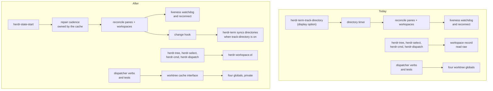

# Cache and Record Ownership - Plan

## Goal Capsule

- **Objective:** A person running herdr.el sees a dashboard that keeps repairing itself and reconnecting while the display options they turned off stay off, and sees a workspace carry the same name everywhere it appears.
- **Means:** Move the repair cadence into the session cache (KTD1), give the workspace record its own leaf module (KTD2), and put an interface on the dispatcher's worktree cache (KTD3).
- **Authority:** The Requirements below win on behaviour. The Key Technical Decisions win on mechanism. `docs/architecture.md` and `CONTRIBUTING.md` win on house style and module boundaries.
- **Execution profile:** Test-first, as `CONTRIBUTING.md` requires. Each unit lands as one commit. The suite must be green at every unit boundary.
- **Stop conditions:** Stop and ask if a unit cannot keep the suite green without changing behaviour the Requirements do not name. Stop if the worktree cache's interface cannot hold every invariant listed in KTD4.
- **Tail ownership:** This plan is the second of three. `docs/plans/2026-09-09-0848-upgrade-to-herdr-0-9-0-plan.md` lands before it; `docs/plans/2026-09-09-0848-connect-to-several-herdr-servers-plan.md` follows it. This plan ends when the three seams are sound.

---

## Product Contract

### Summary

Three seams in herdr.el are owned by the wrong module. The session cache's periodic repair belongs to a terminal display option. The workspace record is read raw in four files. The dispatcher's worktree cache is four globals whose rules live only in docstrings. This plan moves each seam to its owner. Two of the three fix defects that are visible today; all three are prerequisites for following more than one herdr server.

### Problem Frame

herdr.el assumes one server. Work is planned to let it connect to several herdr servers at once, reaching remote ones over SSH. That work is blocked on a fact about the protocol: herdr ids are per-server counters, not globally unique. Every structure keyed by a bare id becomes ambiguous the moment a second connection exists.

Two structures are keyed that way and neither has an interface: the workspace record and the dispatcher's worktree cache. Reshaping them while also adding connections would mean editing them blind.

The third seam is not about keys. The session cache's periodic repair, and the liveness watchdog and reconnect that ride on it, are driven by one global timer owned by a terminal display option. Each connection needs a repair cadence of its own, which a single global timer cannot provide. The session cache's own id keying is untouched by this plan and belongs to the connection work.

Two of the three seams also fail today, with one server.

Setting `herdr-term-track-directory` to nil silently stops the session cache repairing itself on any cadence. That option is documented as whether a buffer follows its pane's working directory. It also gates the only repeating timer in the package, which drives the only *periodic* call to `herdr-state-reconcile-panes`, which the cache's own docstring names as its liveness watchdog and the only signal that a socket stopped answering. A wedged server leaves both event streams open and silent, so nothing else detects it. Turning off a display convenience turns off reconnection.

The 0.9.0 upgrade narrowed this without fixing it, and the plan should not claim more than survives. `herdr-state--settle` now reconciles panes and workspaces, so startup and every reconnect repair the cache and a ghost no longer lasts for the rest of the session by definition. What is left is the case that matters most: a long-lived session that never disconnects never reaches the settle a second time, so with the option off it never repairs again - and the wedged-socket detection that would have caused the reconnect is the very thing that was switched off, so it cannot rescue itself.

A workspace whose server label is the empty string renders in the dashboard with no name. `herdr-tree.el` falls back with a plain `or`, and the empty string is truthy in Emacs Lisp, so the fallback never fires. `herdr-state-workspace-label` exists to catch exactly this case and the dashboard does not call it.

### Key Decisions

- **The 0.9.0 upgrade lands before this plan, and this plan before the multi-connection work.** (session-settled: user-directed.) Each is a separate plan and the order is upgrade, refactor, connections. Governs the Assumptions below rather than any single Requirement.
- **All three cleanups land before the multi-connection work, in one plan, in dependency order.** (session-settled: user-directed - chosen over folding them into the connection plan or naming them as untouched prerequisites: reshaping an id-keyed structure is cheaper before a second id space exists than after.) Governs R1, R4, R7.

### Requirements

**Cache liveness**

- R1. The session cache starts and stops its own periodic repair. No terminal display option can switch it off.
- R2. Turning off directory tracking stops terminal buffers following their pane's working directory, and stops nothing else.
- R3. The documentation describes the repair cadence as a property of the cache, and the remedy for stale rows as a cache option.

**Workspace naming**

- R4. One module reads a workspace record's wire fields.
- R5. A workspace the server labelled with an empty string is named by its id.
- R6. Each surface that shows a workspace asks the module for the name it wants, rather than formatting the record itself.

**Worktree cache**

- R7. The dispatcher's worktree cache answers questions instead of exposing its storage.
- R8. The cache issues its own keys and states its mixed key domain, so the key's shape is decided in one place.
- R9. A test asserts through the cache's interface rather than on its internal shape.

### Scope Boundaries

- Behaviour changes only where a Requirement names it. R5 is the one visible change to what a user sees.
- The knobs `herdr-term-track-directory` and `herdr-term-directory-debounce` keep their names and their documented meanings for directory tracking.
- `herdr-term-directory-interval` is removed outright, not obsoleted. U1 deletes its only reader, and the cache's own repair interval replaces it.

#### Deferred to Follow-Up Work

- Connecting to several herdr servers, the SSH tunnel for a remote control socket, and TRAMP-backed remote terminals. That is `docs/plans/2026-09-09-0848-connect-to-several-herdr-servers-plan.md`, which names this plan as a prerequisite. Everything deferred below is deferred to it.
- Ownership of the `WorktreeInfo` record. It is read raw in `herdr-tree.el` and `herdr-dispatch.el`, and it has the same shape of problem the workspace record has. U4 gives the cache an interface without also giving the records it returns one. This is a deliberate exemption from the criterion the rest of the plan applies, and it is not free: `WorktreeInfo` carries `open_workspace_id`, a bare workspace id, so the connection work inherits it as an untouched prerequisite of its own and should take it on there.
- Two collision guards the connection work owes, which cannot be written until something in the package carries a server: two keys built from the same workspace id on different servers must not collide, and a worktree path reported by two servers must resolve to the right one. The path lookup is the harder of the two, because it searches every listing flattened together and has no tiebreak.
- The remaining architecture-review items: the state cache's change-hook payload, the tree and renderer seam, attach takeover, and packaging hygiene.

#### Outside this plan's identity

- Any change to the herdr server or to the socket protocol.
- Anything the herdr 0.9.0 upgrade requires. Those edits belong to the upgrade plan, which lands first, and this plan assumes they have.

---

## Planning Contract

### Key Technical Decisions

- KTD1. **`herdr-state` owns and publishes the repair cadence.** `herdr-state-start` starts the timer and `herdr-state-stop` cancels it, alongside the reconnect, resubscribe and settle timers it already owns. `herdr-term` stops polling and becomes a listener on `herdr-state-change-functions`, which is the shape `herdr-modeline` already uses. Governs R1, R2.
- KTD2. **`herdr-workspace.el` is a leaf, modelled on `herdr-pane.el`.** It requires no herdr module and takes no cache. Facts a workspace record cannot answer stay where the pane list is: `herdr-state-workspace-directory` derives a directory by walking panes, because `WorkspaceInfo` carries no cwd in protocol 20 or 22, and it does not move. Governs R4, R6.
- KTD3. **The cache issues its own keys, and they stay plain strings.** One alist stores listings under workspace ids and under known-project root paths, so the interface names that mixed domain rather than presenting a workspace-only cache that quietly holds paths. Callers ask the cache for a key from a workspace or from a root rather than composing one, which puts the key's shape in one place. The key stays a string: `herdr-dispatch-refresh` hands the raw listing alist to `herdr-tree-build`, and `herdr-tree.el` looks it up with `assoc` on bare strings in four places, so a key of any other type stops the dashboard drawing worktrees. Widening the key to carry a server is the connection work's job and will touch the constructor and its callers then. This plan does not pretend otherwise: an opaque key would not avoid that edit, because the constructor would gain a server parameter every caller has to supply. Governs R7, R8.
- KTD4. **Keep the generation, pending and unanswered machinery; add only an interface.** The async fetch, the stale-reply guard and the forced retry each defend a failure the tests pin. The defect is that a caller must know almost everything the implementation knows, not that the behaviour is wrong. The interface must hold these five invariants, which today live only in docstrings. Governs R7.
  1. Presence rather than truth records an answer, so every guard uses `assoc` and never `alist-get`.
  2. A request carries the generation it was issued under, and a stale reply drops whole.
  3. Clearing the pending marker without bumping the generation, and bumping without clearing, are opposite failure modes.
  4. The worktree request runs after the draw on every refresh, including a refresh that skips the redraw.
  5. A forced refresh retries every entry that has no answer, in three categories, not two: those that errored, those with no directory, and those whose request is still in flight. The third is easy to omit and omitting it is a regression, not a simplification - `herdr-dispatch--retry-unanswered-worktrees` says in its own docstring that clearing a pending marker is the only thing that can rescue an in-flight request before its timeout, and `herdr-dispatch-a-reply-that-never-comes-is-cured-by-g` pins it. Clearing a pending marker must bump the generation with it, per invariant 3. An entry answered with an empty listing keeps its answer.
- KTD5. **Presence stays distinct from truth.** A repository with no worktrees caches as an entry whose value is nil and must not be asked again, which is why every guard uses `assoc` rather than `alist-get`. The unanswered list keeps its reason, error or no-directory, because that is what lets a forced refresh retry exactly those. Both distinctions have consumers today and the interface carries both. A caller asking for a path's record still cannot tell unanswered from cached-error from not-in-any-listing, and the refusal message collapses all three; no caller branches on that difference, so this plan leaves it alone rather than building a result type richer than anything reads it. Governs R7, R9.

### High-Level Technical Design

Ownership today, and after. The arrows are "drives" or "reads".

The four questions the worktree cache should answer, as directional guidance rather than a signature list: what a workspace's listing is, what record a path names, whether an event means the cache is stale, and what still needs fetching.

### Assumptions

- herdr ids are per-server counters. Measured with `herdr api snapshot` against a herdr 0.8.2 server: workspace ids read `w2F`, pane ids `w2F:p2`, tab ids `w2F:t2`. One server was measured, so the measurement alone would not carry this; herdr 0.9.0 states it instead. Its multi-machine guide says workspace, tab and pane ids and agent names are scoped to one server, and that two machines may each hold a `w1:p1`. This is the plan's load-bearing fact, it is now upstream-documented rather than inferred, and `docs/protocol.md` records neither the shape nor the scoping yet, so U3 adds both there.
- `WorkspaceInfo`'s fields are as the captured schema fixture records them. Only `workspace_id`, `label`, `pane_count` and `agent_status` are read anywhere in the package, and every field except `workspace_id` may be absent from a record a test constructs. The upgrade plan lands first and renames that fixture from `schema-protocol-20.json` to `schema-protocol-22.json`, so units here name the protocol-22 fixture. The rename is all that changes: `WorkspaceInfo`, `WorkspaceWorktreeInfo`, `PaneInfo`, `AgentInfo` and `SessionSnapshot` are field-for-field identical between the two schemas, so no unit here waits on anything but the rename.
- `herdr-state-reconcile-workspaces` has one caller in the package today, so moving its cadence changes no other path.

### Sequencing

U1 is independent and lands first, because it is the smallest and it repairs a live defect. U2 and U3 land next. U4 follows them because U3 and U4 both edit `herdr-dispatch--request-worktrees`, so landing them out of order costs a conflict; the cache has no other dependency on the workspace module. U5 lands last.

---

## Implementation Units

### U1. The cache owns its repair cadence

**Goal:** Move the periodic reconcile out of the terminal directory poll and into `herdr-state`, so cache repair and reconnection no longer depend on a display option.

**Requirements:** R1, R2, R3.

**Dependencies:** None.

**Files:**
- `herdr-state.el` - add the repair timer, its start and stop, the repair-now entry point, and `herdr-state-repair-interval`.
- `herdr-term.el` - remove the poll, keep directory syncing as a change-hook listener.
- `test/herdr-state-test.el` - cadence lifecycle and cancellation tests.
- `test/herdr-term-test.el` - move the coupling test, keep the directory-sync tests.
- `docs/configuration.md`, `docs/architecture.md` - correct the cadence and the remedy.

**Approach:**

1. Extract the repair pair before adding a caller for it. `herdr-state--settle` already reconciles panes then workspaces, in that order and under the same background-timeout binding, since the 0.9.0 upgrade. That is exactly what this unit's timer callback needs, so it becomes one function with two callers rather than two implementations that must be kept in step. The settle keeps calling it where it calls the pair today.
2. Add a repeating repair timer to `herdr-state`, started by `herdr-state-start` and cancelled by `herdr-state-stop` alongside the reconnect, resubscribe and settle timers. Its callback is the extracted pair, under a re-entrancy guard the settle does not need and this does.
3. Add `herdr-state-repair-interval`, defaulting to 5.0 seconds, with nil meaning no periodic repair. The prefix follows `herdr-state-settle-delay`, which already names cache timing, and the default matches the cadence the directory poll runs at today so nobody's repair rate changes. Document it under the event stream, not under terminals, and point the removed directory-interval row at it.
4. Reduce `herdr-term` to a listener. `herdr-term--on-state-change` keeps syncing buffer directories, gated on `herdr-term-track-directory`. Delete the poll, the repeating timer and its start. Not `herdr-term--stop-directory-timer` as it stands: it cancels the debounce timer as well as the repeating one, it is the debounce's only `cancel-timer` caller, and `herdr-term-stop` is its only caller. Deleting it whole leaves `herdr-term-stop` with a live debounce timer firing into a cache nobody owns. Either narrow it to the debounce and rename it for what it now stops, or fold that cancel into `herdr-term-stop`; do not leave the debounce uncancelled. Delete `herdr-term-directory-interval` with the repeating timer, and its row in `docs/configuration.md`: the timer is its only reader, and the cache's repair interval replaces it.
5. Publish the extracted pair from step 1 as a repair-now entry point, callable on demand and bound to the background timeout like every other timer-borne call. It is the same function the timer fires and the settle calls; this unit only gives it a name callers outside `herdr-state` may use. `herdr-term-directory-debounce` keeps its meaning and its cancel-and-rearm shape, but the debounce calls the repair entry point instead of reaching for a reconcile function. Without this the debounce would re-read a cache nothing refreshed: a `cd` produces no event herdr.el acts on - `layout.updated` is a no-op in the reducer - so a pane's directory reaches the cache only through a pane reconcile, and directory tracking would silently degrade from the debounce interval to the repair interval.
6. Correct the two documents that still name the option. `docs/configuration.md` lists it in the options table and tells the reader to decrease it when dead panes linger, and claims the poll runs only while terminal buffers exist. `docs/architecture.md:88` states the cadence as every directory poll. Not `docs/troubleshooting.md`, which repeated that advice until the 0.9.0 upgrade rewrote the section around it - check it rather than trusting this list, because that is the kind of claim a plan carries past its expiry.

**Execution note on the startup rollback:** `herdr-state-start`'s error handler clears `herdr-state--running` and removes one hook. It does not close streams and it does not cancel timers, because until now it could not have opened or armed any that outlived it. Adding a repair timer changes that: arm the timer after the streams are open, and unwind it on the same error path, or a failed start leaves a repeating timer reconciling against a cache whose owner believes it is stopped. Assert the unwind, not just the arm.

**Execution note:** Write the cancellation tests first. `test/herdr-term-test.el` records that dropping both `cancel-timer` calls once passed the whole suite, because a guarded poll swallows a spurious later fire. Assert the cancellation, not the nilled variable.

**Patterns to follow:** `herdr-modeline-mode` for a listener that adds and removes its hook symmetrically and paints once on enable. `herdr-state-stop` for the existing timer-teardown shape.

**Test scenarios:**
- Starting the cache arms the repair timer; stopping it cancels the timer and nils its handle.
- `herdr-term-stop` still cancels a pending directory debounce, and nils its handle. This is the timer whose only canceller the poll's teardown used to be.
- A start that fails after the timer is armed leaves no armed timer and leaves `herdr-state--running` nil.
- Stopping the cache passes the live timer handle to `cancel-timer`, and passes nothing when no timer is armed.
- The repair callback reconciles panes and then workspaces, in that order.
- The repair callback binds `herdr-rpc-timeout` down to `herdr-rpc-background-timeout`.
- The repair callback does not nest inside its own wait when the cache changes while a reconcile is in flight.
- `herdr-state-repair-interval` set to nil arms no timer, and the cache still starts.
- With `herdr-term-track-directory` nil, a repair still runs and a reconcile failure still schedules a reconnect.
- With `herdr-term-track-directory` nil, no terminal buffer's `default-directory` is changed.
- With `herdr-term-track-directory` non-nil, a cache change updates a terminal buffer's directory.
- Starting the cache twice arms one timer.
- A cache change refreshes a terminal buffer's directory within the debounce interval, proving the debounce reaches a repair rather than re-reading a stale cache.
- The repair-now entry point binds the background timeout, the same as the timer path.
- The cache starts, repairs and stops with no terminal buffer in existence and `herdr-term-ensure` never called. This is the invariant a green suite could otherwise hide: if the repair only runs because something opened a terminal, the coupling this unit removes has merely moved.

**Verification:** `herdr-term` no longer calls either reconcile function directly, reaching repair only through the published entry point. A `cd` still refreshes a terminal buffer's directory within the debounce interval, not the repair interval. Turning off directory tracking leaves the watchdog running. The three documents describe the cadence as the cache's.

---

### U2. A workspace record has one reader

**Goal:** Create `herdr-workspace.el`, a leaf that owns the workspace record's wire fields and the names built from them. No caller changes yet.

**Requirements:** R4, R5. R6 is delivered by U3, which moves the callers.

**Dependencies:** None.

**Files:**
- `herdr-workspace.el` - new.
- `test/herdr-workspace-test.el` - new.

**Approach:**

1. Read the record's fields: id, label, pane count and agent status. Nothing else is read anywhere in the package, so nothing else gets an accessor.
2. Answer the same two questions `herdr-pane.el` answers, in the workspace's own terms. The name is what a workspace is called when it has a label. The identity is what you call it when it may not, and it is never empty: label, else id.
3. Treat an empty label as no label, the rule `herdr-pane--said` applies and `herdr-state-workspace-label` open-codes today.
4. Take no cache. A workspace's directory is derived from its panes and stays in `herdr-state`.
5. Tolerate a record carrying only an id. Tests across the suite construct workspaces that minimal.

**Execution note:** Implement test-first. The empty-label case is the defect this module exists to remove, so write that test before the accessor.

**Patterns to follow:** `herdr-pane.el` end to end, including the file summary line phrased as a question, the private helper for empty-means-absent, and a docstring on each accessor naming the bug it prevents.

**Test scenarios:**
- Each accessor returns its field, and returns nil when the record omits it.
- A record carrying only an id answers every accessor without signalling.
- An empty label reads as no label.
- Identity falls back to the id when the label is empty, and when the label is absent.
- Identity is never the empty string.
- The name is the label when there is one.
- The module requires no herdr module, asserted by scanning its own source for a herdr require.

**Verification:** The new file compiles with warnings as errors and its tests pass. No other file changed.

---

### U3. Every reader goes through the module

**Goal:** Move every raw workspace-record read onto `herdr-workspace.el`, fix the empty-label rendering, and add the test that keeps the seam closed.

**Requirements:** R4, R5, R6.

**Dependencies:** U2.

**Files:**
- `herdr-tree.el` - the workspace node, the nesting, the repository lookup and the build loop.
- `herdr-select.el` - the workspace annotation, the candidate row and the place annotation.
- `herdr-cmd.el` - the two reads off a workspace found by directory, and `herdr-cmd--workspace-description`.
- `herdr-dispatch.el` - the read in the worktree request loop.
- `herdr-state.el` - `herdr-state-workspace`, `herdr-state-workspace-label`, `herdr-state-workspace-for-directory` and the reconcile.
- `test/herdr-workspace-test.el` - the seam-enforcement test.
- `test/herdr-state-test.el`, `test/herdr-state-live-test.el`, `test/herdr-dispatch-live-test.el`, `test/herdr-project-test.el` - assertions that read records raw.
- `docs/architecture.md` - add the `herdr-workspace.el` row to the file table, and correct the sentence in the pure and impure section that says `herdr-tree.el` requires `herdr-state.el` and `herdr-pane.el` only.
- `docs/protocol.md` - record that herdr ids are per-server counters and are scoped to one server, with both the measurement and the upstream statement from Assumptions.

**Approach:**

1. Replace each raw read with the module's accessor. `herdr-state` included: it resolves a pane through `herdr-pane-id` already and should resolve a workspace the same way. Seven reads bind the record to a name the enforcement test cannot see, so migrate them from this list rather than from the test's output: `herdr-cmd.el` binds it as `existing` and as `open`, `herdr-select.el` binds it as `w` when mapping workspace ids, `herdr-tree--workspace-repository` binds it as `parent`, and `herdr-state-reconcile-workspaces` binds it as `w` three times.
2. Fix the dashboard heading. `herdr-tree.el` falls back with a plain `or`, so an empty label renders as no name. It becomes an identity lookup.
3. Collapse the display conventions onto one accessor, under a rule that survives contact with the surfaces. The rule is not "identity everywhere": it is **no surface renders a workspace as nameless**. Where a surface prints one field for the workspace, that field is identity. Where a surface already prints the id as its own token, the name field keeps the raw label and may be empty, because the row is named already and identity there would print the id twice. Keep each surface's own column layout and quantity - the dashboard shows a checkout count, the picker annotation shows the record's pane count.

   The four surfaces split three ways:

   - `herdr-tree.el:432`, the dashboard heading, prints `(or label id)` and nothing else identifying. **Identity applies.** This is the empty-label defect step 2 fixes.
   - `herdr-select--workspace-candidate` builds the row as the id followed by `herdr-select--annotate-workspace`, whose first column is `(or label "")`. **The column stays as it is.** Identity here renders an unlabelled `w2F` as `w2F  w2F  3 panes` - the id twice, in exactly the case this unit exists to fix.
   - `herdr-select--place-candidate` leads with the place, which is a workspace id *or* a directory path, and delegates its annotation to the same function. **The column stays as it is** for both. A path-shaped place whose workspace is unlabelled reads `~/proj    3 panes`, which names the row by its path and is better than an id, not worse.
   - `herdr-cmd--workspace-description` already answers `label (id)` or a bare id. **It is already correct and does not change.** Switching it to identity would either drop the parenthesised id that makes a confirmation unambiguous, or produce `w2F (w2F)`.

   Any accessor returning the raw label stays separate and is not a display accessor.
4. Add the enforcement test, modelled on the pane one: scan every package source except the new module for a field read off a variable named `workspace`, and report offenders as file and line.
5. Leave `herdr-state-workspace-directory` and `herdr-state-workspace-for-directory` where they are. They walk the pane list, so they need the cache.

**Execution note:** Add the enforcement test first and let it fail with the current offender list. That list is a floor, not the complete checklist: like the pane test it copies, it matches only a record bound to a variable of the expected name, so the seven reads named in step 1 pass it while still reading the record raw. Work from step 1's list and use the test as the backstop.

**Patterns to follow:** commits `80fa18a` and `9df6a20`, which landed the pane module and then moved its readers. The pane enforcement test at `test/herdr-pane-test.el` for the regexp shape, including the whitespace classes that catch a wrapped call and a three-argument `alist-get`.

**Test scenarios:**
- The enforcement test reports no offender across the package sources.
- A workspace with an empty label renders in the dashboard heading as its id, not as a blank.
- A workspace with a label renders as that label.
- For a labelled workspace, the dashboard heading and the picker row both show the label.
- For an unlabelled workspace, the dashboard heading shows the id, and the picker row contains the id exactly once. Asserted on the whole rendered row, not on the annotation in isolation: the rule is about what a reader sees, and the annotation alone cannot answer it.
- The place picker renders a path-shaped place and an id-shaped place, each for an unlabelled workspace, and neither row repeats its leading token.
- A confirmation prompt names a workspace the same way after the change as before, both for a labelled workspace and for an unlabelled one. `herdr-cmd--workspace-description` is unchanged by this unit and the test is what says so.
- A workspace absent from the cache still annotates without signalling.
- `herdr-state-workspace-for-directory` still finds a workspace by its root, with and without a trailing slash.

**Verification:** The enforcement test passes. The dashboard names an empty-labelled workspace. `make test` and `make test-live` are green.

---

### U4. The worktree cache answers questions

**Goal:** Put an interface over the four dispatcher globals, keeping the async fetch, the generation guard and the forced retry intact.

**Requirements:** R7, R8, R9.

**Dependencies:** U3.

**Files:**
- `herdr-dispatch.el` - the worktrees section.
- `test/herdr-dispatch-test.el` - tests for the interface itself.
- `herdr-tree.el` - deliberately not edited. It looks the listing up with `assoc` on bare strings in four places (`herdr-tree.el:233`, `:377`, `:476`, `:604`) and receives the raw alist from `herdr-dispatch-refresh`. KTD3 keeps the key a plain string for exactly this reason, so the renderer is the constraint on the constructor rather than a caller of it. Naming the file here is what stops a later reader deciding the constructor may prefix its keys.

**Approach:**

1. Define the four questions a caller actually asks: a key's listing, the record a path names, whether an event makes the cache stale, and what still needs fetching. Everything else becomes private.
2. Give the key a constructor and make it the only source of one, per KTD3. One alist holds listings under workspace ids and under known-project root paths; `herdr-tree-build` already documents that mixed domain and the cache should too. The key stays a plain string, because the renderer receives the listing alist and looks it up with `assoc`.
3. Preserve presence against truth. An entry whose value is nil is an answer. Guards keep using `assoc`.
4. Keep the two distinctions that have consumers, per KTD5: presence against truth, and the unanswered entry's reason. Do not build a result type richer than any caller reads.
4a. Make the interface's forced-retry answer all three unanswered categories of invariant 5, pending included. An interface that exposes only errored and no-directory entries cannot express the rescue the existing keystroke performs, so this is a shape constraint on the interface and not only a behaviour to preserve.
5. Keep the flattened lookup's behaviour and name its cost. A worktree row knows its path and not which listing answered for it, so the search concatenates every listing. This is also why closing a workspace drops the whole cache, and why a stale `open_workspace_id` in another workspace's listing must go with it.
6. Leave the records themselves alone. `WorktreeInfo` fields stay read as they are read today; giving that record an owner is deferred.

**Execution note:** This unit adds the interface and leaves the call sites. Write the interface's own tests first, then U5 moves the callers.

**Patterns to follow:** The whole interface stays in `herdr-dispatch.el`, beside the async fetch it guards. `CONTRIBUTING.md` does put new logic in `herdr-tree.el` where it needs no socket and no display, but that rule does not reach here: `herdr-tree-build` takes the worktree listing as a parameter precisely so cache state stays out of that file, and `docs/architecture.md` records the purity contract that parameter exists to hold. Moving the cache there would invert it. `herdr-tree.el` goes on receiving the listing as a parameter, unchanged.

**Test scenarios:**
- A key answered with no worktrees reads as answered, and is not asked again.
- A key never asked reads as not answered.
- A key whose fetch errored is retried by a forced refresh and not by an ordinary one.
- A key with no directory is retried once a directory exists.
- A path present in one listing resolves to its record.
- A path present in no listing resolves to nothing.
- A reply from an older generation writes nothing and clears no pending marker.
- An invalidation bumps the generation and empties the cache, the pending set and the unanswered list together.
- A forced retry drops only the unanswered entries and keeps a genuinely empty answer.
- The interface reports what still needs fetching, excluding both answered and pending keys.
- A key built from a workspace and a key built from a root are distinguishable, and both are strings the renderer can look up with `assoc`.
- A listing stored under a constructed key is found by `herdr-tree.el`'s own lookup, driven through `herdr-tree-build` rather than through the cache, so the test fails if the constructor ever starts decorating its keys.

**Verification:** The interface answers each of the four questions. The generation, pending and unanswered behaviours are unchanged, proved by the existing tests still passing.

---

### U5. The dispatcher and its tests use the interface

**Goal:** Move every caller and every test off the raw globals, so the cache's storage is private.

**Requirements:** R7, R9.

**Dependencies:** U4.

**Files:**
- `herdr-dispatch.el` - the refresh path, the create-worktree verb, `herdr-agents`, and the target-record resolution.
- `test/herdr-dispatch-test.el` - the worktree-cache block and the verb tests that bind the cache by hand.

**Approach:**

1. Move the callers outside the worktrees section: the refresh path retries and requests, the create verb invalidates, and `herdr-agents` invalidates and installs the invalidation hook.
2. Keep the fetch after the draw. A skipped redraw means the tree equals what is on screen, and a tree built with no worktrees known keeps equalling itself, so keying the fetch to the redraw would leave a workspace unasked forever.
3. Rewrite the tests that assert on internal shape. Those asserting through a verb or through the checked-worktree helper need only their setup changed. Three assert the pending set's exact contents and order, and several assert the generation's exact integer; decide per test whether the interface should answer that question or whether the test should assert the behaviour the number produces.
4. Give the test helper a constructor, and make it the only place allowed to seed private cache state. `herdr-dispatch-test-in-dispatcher` rebinds all four globals, and the verb tests that use the other helper bind only the cache by hand, leaving three globals at session values. One seeding function replaces both. Every other test asserts on the interface's answers. This is the boundary Verification checks, not merely the absence of alist-shape assertions: a suite that keeps binding the globals directly is still coupled to storage even with every assertion rewritten.
5. Fix the trail left by the last rename. The record lookup's docstring has two apostrophe escapes that the help system will eat, one test docstring still names the function PR 28 removed, and another names a function that only ever existed in a plan document.

**Execution note:** Rewrite the raw-shape tests one at a time, keeping the suite green. Each rewritten test should fail if the interface's answer is wrong, not merely if the alist's shape changed.

**Patterns to follow:** `herdr-dispatch-test-in-dispatcher` for why every piece of worktree state must be rebound and not just the cache, and for the stub on known project roots that keeps the suite off the machine's real project list.

**Test scenarios:**
- Only the seeding constructor binds or reads the four globals; no other test does either.
- A worktree row still resolves to its record once per point resolution.
- The refresh path still asks for a workspace's worktrees exactly once while a reply is outstanding.
- A forced refresh still reissues the unanswered and leaves the answered alone.
- Every worktree event and a workspace close still drop the cache.
- A workspace close still removes another workspace's listing that claims the closing workspace as open.
- An unrelated event still leaves the cache and the generation untouched.
- A reply landing after the dashboard buffer is killed still caches and schedules no redraw.
- The verb tests refuse and act on the same rows as before.

**Verification:** The four globals are touched only inside the cache's own code and the one test-seeding constructor. `make test` and `make test-live` are green, with no test asserting on the raw alists.

---

## Verification Contract

| Gate | Command | Applies to |
|---|---|---|
| Byte compilation, warnings as errors | `make compile` | Every unit |
| Hermetic suite | `make test` | Every unit |
| Live suite against a running server | `make test-live` | U1, U3, U5 |
| Real frame check | Drive a real Emacs, open the dashboard | U1, U3, U5 |

`make test` is hermetic and must stay so. A test that would read a file, an environment variable or the machine's project list stubs that source.

The real-frame check is not optional for the three units above. The suite runs in batch and has no frame, so it cannot catch a modeline that renders as invalid, a command that splits a window, or a require that nothing pulls in any more. U1 changes a timer that drives redraws, U3 changes what the dashboard prints, and U5 changes the dashboard's refresh path.

`make test-live` includes the drift test, which compares each curated command against the running server's schema.

---

## Definition of Done

**Global**

- Every Requirement is met, and R5 is demonstrated in a real frame.
- All four gates pass, and the real-frame check is reported for U1, U3 and U5, saying what was driven and what was not.
- No abandoned approach is left in the tree.
- Documentation is updated in the same commit as the code it describes.
- No file gained an absolute path, a count that will go stale, or an em dash.

**Per unit**

| Unit | Done when |
|---|---|
| U1 | The cache arms and cancels its own repair timer under `herdr-state-repair-interval`, `herdr-term` reaches repair only through the published entry point, `herdr-term-directory-interval` is gone, and the three documents describe the cadence as the cache's. |
| U2 | `herdr-workspace.el` compiles, requires no herdr module, and answers every accessor for a record carrying only an id. |
| U3 | The enforcement test reports no offender, the seven reads it cannot see are migrated too, and an empty-labelled workspace shows its id on every surface. |
| U4 | The cache answers the four questions, and the existing behaviour tests pass unchanged. |
| U5 | The four globals are read only by the cache's own code, and no test asserts on their shape. |

---

## Risks

- **Removing the directory interval is silent for anyone who set it.** The option is documented in two places as the remedy for stale rows, so a user may well have lowered it, and a deleted `defcustom` produces no warning in their init file. This is an accepted cost of removing it outright rather than obsoleting it. Give the new repair option the same default the directory poll has today, and say in `docs/configuration.md` what to set instead.
- **U5 touches many tests at once, and a rewritten test can pass for the wrong reason.** A test that asserted an alist's shape and now asserts an interface's answer may assert nothing if the interface is asked the wrong question. Rewrite one at a time and confirm each still fails when the behaviour is broken.
- **Removing the terminal poll may leave directories stale.** A `cd` produces no event, so directory freshness rides on the repair cadence. U1 step 5 makes this an explicit decision rather than a discovery.
- **This plan runs on a server whose event stream just changed.** The 0.9.0 upgrade lands first and removes the retained-ring replay: a subscription now starts at the sequence its request arrived on. A gap the replay used to paper over is closed by nothing but a reconcile, which raises the stakes on U1 without changing its shape - after U1 the repair cadence is owned by `herdr-state` and is no longer switched off by a terminal display option. Two consequences to hold. First, every unit here is written and verified against protocol 22 with no replay, so a test that passed by accident on a replayed event will now fail honestly. Second, the upgrade's own U2 edits `herdr-state-start`'s error path and U1 here adds a timer to the same function, so the two touch the same rollback: whichever lands second owns making that rollback cover both.

## Sources

- `.blackboard/todo.org` - the three backlog entries, from the architecture review's strong candidates.
- `docs/architecture.md` - the module map, the reconciliation contract, and the rules for a change.
- `CONTRIBUTING.md` - test-first, the pure and impure halves, house documentation style, and the batch suite's blind spot.
- `test/fixtures/schema-protocol-22.json` - `WorkspaceInfo` and `WorkspaceWorktreeInfo` field sets. Named `schema-protocol-20.json` until the upgrade plan's U1 recaptures it.
- herdr 0.9.0's `docs/next/api/herdr-api.schema.json` and `connecting-machines.mdx` - protocol 22, the unchanged record shapes, and the statement that ids are scoped to one server.
- herdr 0.9.0's `src/api/subscriptions.rs` - the replay removal, whose upstream test is named `lifecycle_subscription_skips_history_but_keeps_setup_window_events`.
- `herdr-pane.el` and `test/herdr-pane-test.el` - the leaf module and its enforcement test, the template for U2 and U3.
- Commits `80fa18a`, `9df6a20`, `76ca45a` - how the pane module and the resolved target landed.
